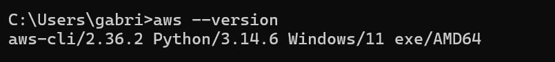
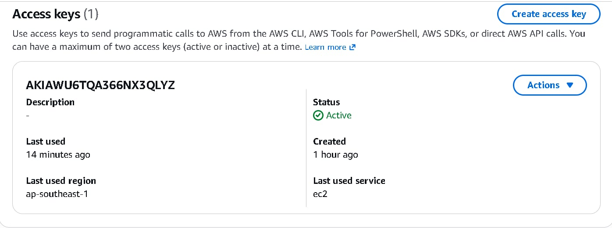
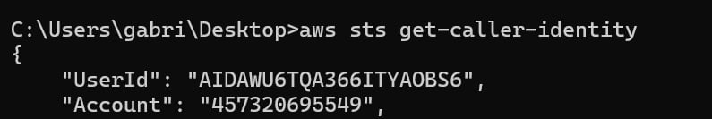
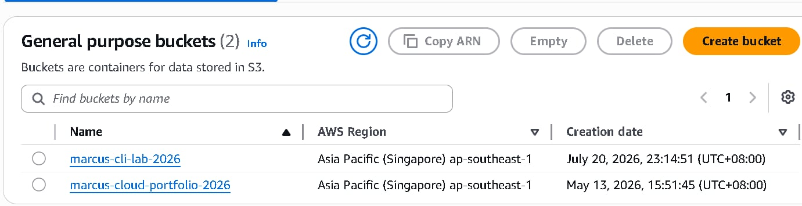
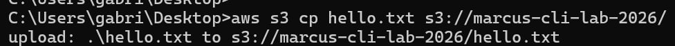
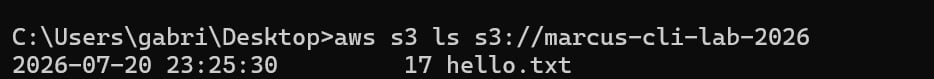
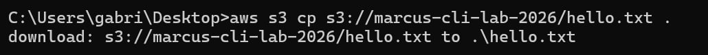
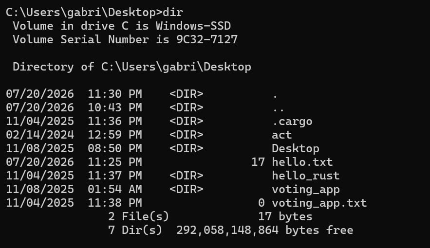
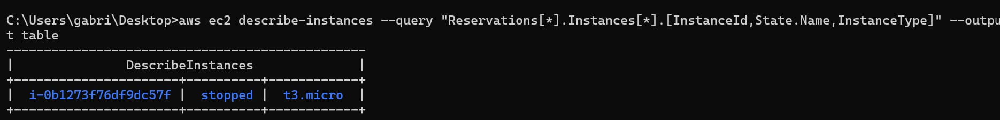

# AWS CLI Fundamentals Lab

## 📖 Project Overview

This project demonstrates the installation, configuration, and practical usage of the AWS Command Line Interface (AWS CLI). The lab focuses on authenticating with AWS using IAM credentials and managing Amazon S3 resources through CLI commands instead of the AWS Management Console.

---

## 🏗️ Architecture

```
Local Computer
       │
       │ AWS CLI
       ▼
IAM User Authentication
       │
       ▼
Amazon S3 Bucket
       │
       ├── Upload File
       ├── List Objects
       └── Download File
```

---

## ☁️ AWS Services Used

- AWS CLI v2
- AWS IAM
- Amazon S3
- Amazon EC2 (Read Operations)

---

## 🚀 What I Built

- Installed AWS CLI Version 2
- Configured AWS CLI using IAM Access Keys
- Verified AWS identity using STS
- Created a dedicated S3 bucket for CLI operations
- Uploaded files to Amazon S3
- Listed S3 bucket contents
- Downloaded files from Amazon S3
- Executed AWS CLI EC2 commands
- Practiced troubleshooting IAM permission errors

---

## 💻 AWS CLI Commands Used

```bash
aws --version

aws configure

aws sts get-caller-identity

aws s3 cp hello.txt s3://marcus-cli-lab-2026/

aws s3 ls s3://marcus-cli-lab-2026

aws s3 cp s3://marcus-cli-lab-2026/hello.txt .

aws ec2 describe-instances --query "Reservations[*].Instances[*].[InstanceId,State.Name,InstanceType]" --output table
```

---

## 🛠️ Skills Demonstrated

- AWS CLI Configuration
- IAM Authentication
- Amazon S3 File Management
- EC2 CLI Queries
- AWS STS Identity Verification
- Command Line Operations
- Troubleshooting IAM Permissions

---

## 📷 Project Screenshots

| Step | Screenshot |
|------|------------|
| AWS CLI Installation |  |
| IAM Access Key |  |
| Caller Identity |  |
| Create S3 Bucket |  |
| Upload File |  |
| List Bucket |  |
| Download File |  |
| Download Verification |  |
| EC2 CLI Command |  |
| S3 Bucket Content |  |

---

## 📚 Lessons Learned

- AWS CLI provides a fast and efficient way to manage AWS resources.
- IAM permissions directly affect CLI operations.
- AWS STS helps verify the currently authenticated IAM identity.
- Separating resources into dedicated buckets simplifies management.
- Troubleshooting AccessDenied errors requires checking IAM policies, bucket configuration, and CLI credentials.
