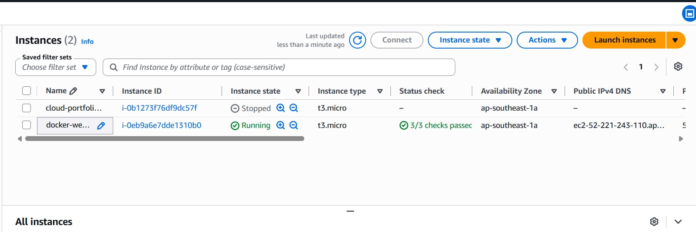
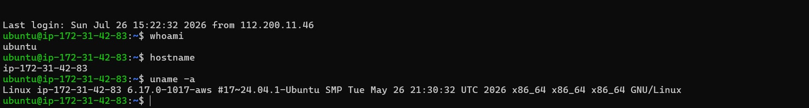
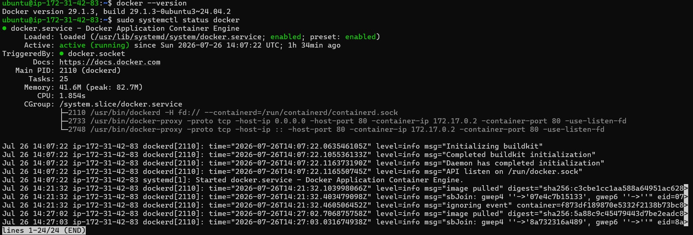
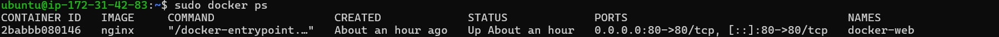
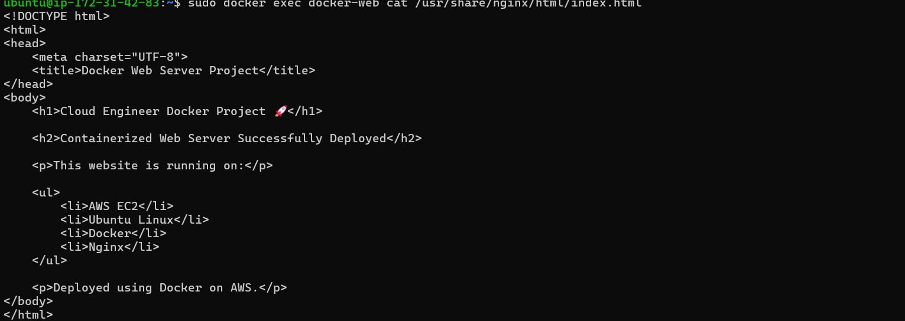
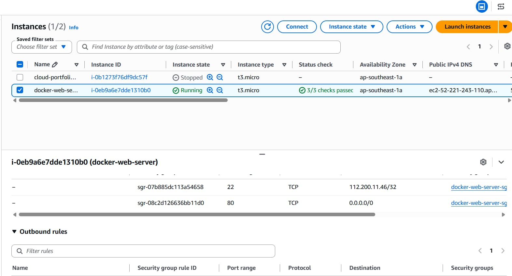
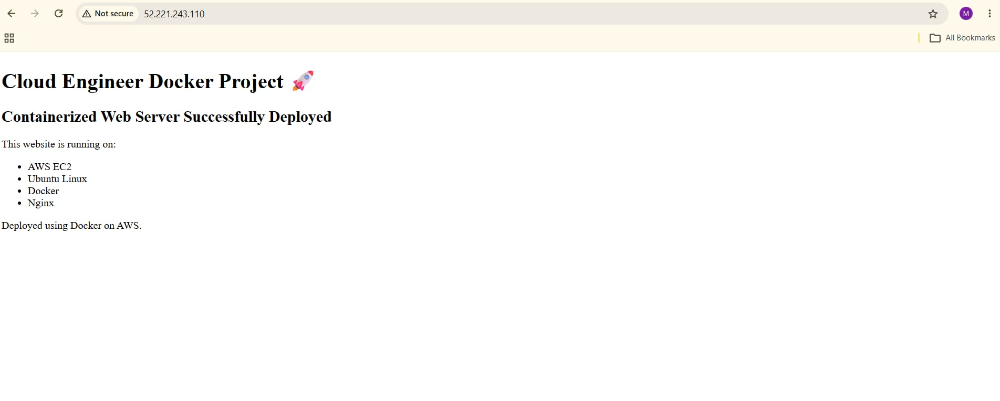
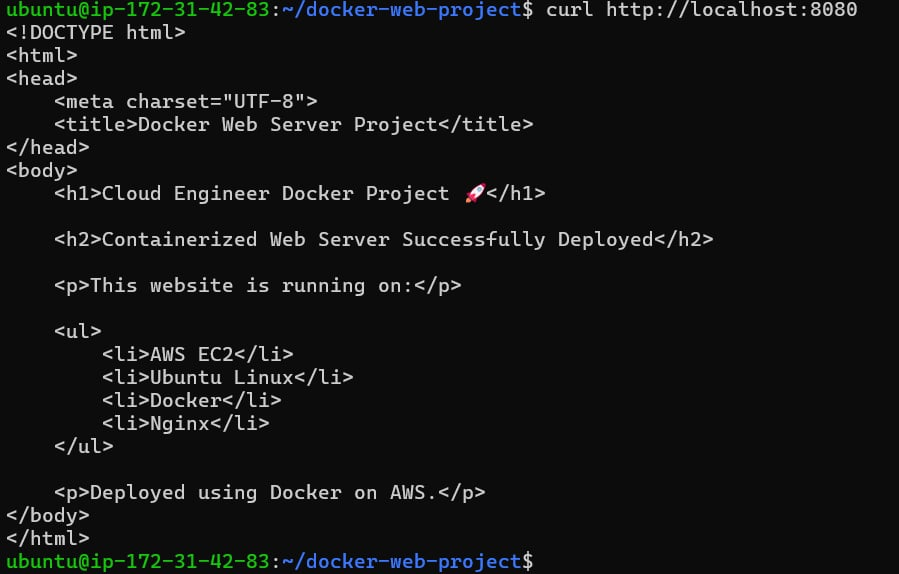

# 🐳 AWS EC2 Dockerized Nginx Web Server

## 📌 Project Overview

This project demonstrates deploying a containerized Nginx web server on an AWS EC2 Ubuntu instance using Docker.

The project includes provisioning an EC2 instance, configuring network access, connecting through SSH, installing Docker, running an Nginx container, deploying a custom HTML page, creating a Dockerfile, building a custom Docker image, and testing the containerized application.

---

## 🏗️ Architecture

```text
                    Internet
                       |
                       | HTTP :80
                       v
              AWS Security Group
                       |
                       v
                AWS EC2 Instance
                 Ubuntu Linux
                       |
                       v
                 Docker Engine
                       |
                       v
               Nginx Container
                       |
                       v
                  index.html
```

---

## 🛠️ Technologies Used

- AWS EC2
- Ubuntu Linux
- Docker
- Nginx
- SSH
- AWS Security Groups
- HTML
- Linux CLI

---

## 🔐 Network Configuration

The EC2 Security Group was configured with:

| Protocol | Port | Purpose |
|---|---:|---|
| SSH | 22 | Remote administration from authorized IP |
| HTTP | 80 | Public web access |

SSH access was restricted to a specific IP address while HTTP traffic was allowed for public access.

---

## 🚀 Deployment Process

### 1. Launch EC2 Instance

An Ubuntu EC2 instance was launched and configured with a public IPv4 address.

### 2. Connect Through SSH

The server was remotely administered through SSH.

### 3. Install and Verify Docker

Docker was installed on the Ubuntu server and the Docker service was verified.

```bash
docker --version
sudo systemctl status docker
```

### 4. Run Nginx Container

An Nginx container was deployed with port 80 on the EC2 host mapped to port 80 inside the container.

```bash
sudo docker run -d --name docker-web -p 80:80 nginx
```

### 5. Deploy Custom Web Page

A custom `index.html` file was created and copied into the running Nginx container.

```bash
sudo docker cp index.html docker-web:/usr/share/nginx/html/index.html
```

### 6. Create Dockerfile

A custom Docker image was then defined using:

```dockerfile
FROM nginx:latest

COPY index.html /usr/share/nginx/html/index.html

EXPOSE 80
```

### 7. Build Custom Docker Image

```bash
sudo docker build -t cloud-docker-web:v1 .
```

### 8. Run Custom Image

The custom image was launched as a separate container for testing.

```bash
sudo docker run -d --name cloud-docker-container -p 8080:80 cloud-docker-web:v1
```

### 9. Verify Deployment

The custom container was tested locally from the EC2 instance:

```bash
curl http://localhost:8080
```

The public Nginx deployment was also verified through the EC2 public IP using a web browser.

---

## 📸 Project Screenshots

| Step | Screenshot |
|---|---|
| EC2 Instance Running |  |
| SSH Linux Connection |  |
| Docker Running |  |
| Nginx Container Running |  |
| HTML Inside Nginx Container |  |
| Security Group Rules |  |
| Final Web Deployment |  |
| Custom Docker Image Test |  |

---

## 🧠 Key Concepts Practiced

- Provisioning Linux virtual machines using AWS EC2
- Remote Linux administration through SSH
- Configuring Security Groups for SSH and HTTP
- Installing and managing Docker on Ubuntu
- Working with Docker images and containers
- Building custom Docker images using Dockerfiles
- Docker port mapping
- Running Nginx inside a container
- Deploying static web content with Nginx
- Testing HTTP services using `curl`
- Basic container troubleshooting

---

## 💡 What I Learned

This project helped me understand the relationship between cloud infrastructure and containerization.

Instead of only running an application directly on an EC2 server, I deployed Nginx inside a Docker container and mapped network traffic from the EC2 host to the container.

I also learned the difference between a Docker image and a container and how a Dockerfile can be used to create a repeatable custom image containing application files.

---

## 📂 Project Structure

```text
AWS Docker EC2 Lab Project/
├── README.md
├── Dockerfile
├── index.html
└── screenshots/
    ├── 01-ec2-instance-running.png
    ├── 02-ssh-linux-connection.png
    ├── 03-docker-running.png
    ├── 04-nginx-container-running.png
    ├── 05-nginx-container-html.png
    ├── 06-security-group-rules.png
    ├── 07-final-web-page.png
    └── 08-custom-docker-image-test.png
```
