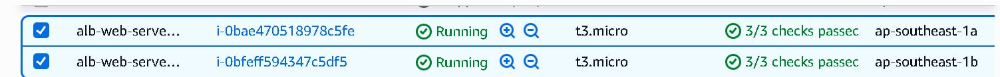
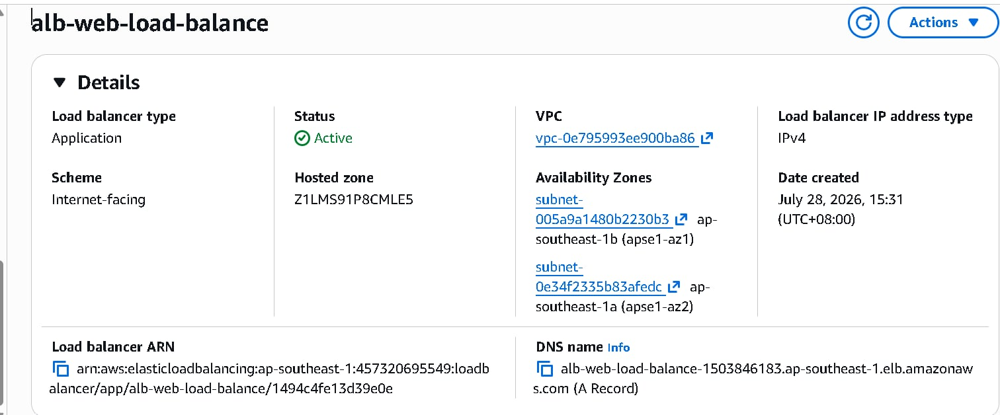
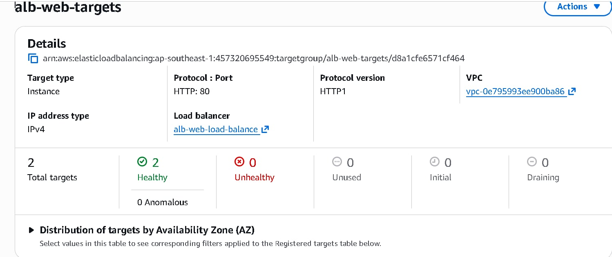
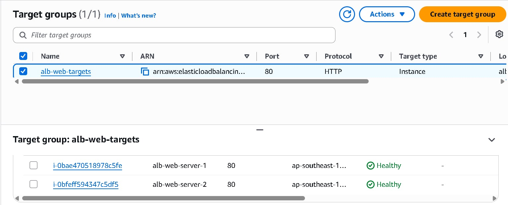
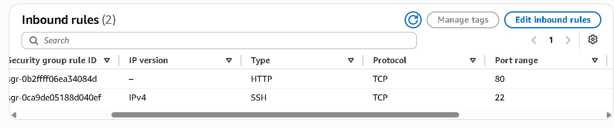
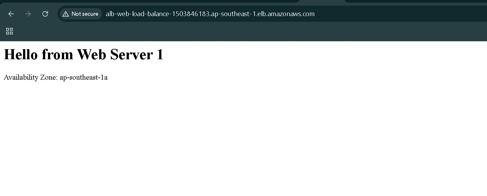
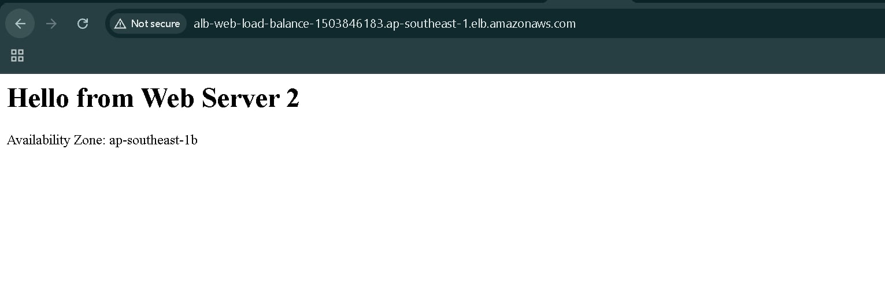
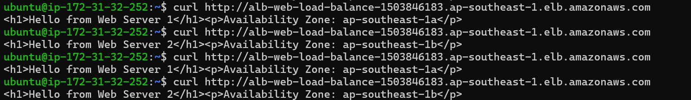

# AWS Application Load Balancer (ALB) with High Availability

## Overview

This project demonstrates how to deploy a highly available web application using an AWS Application Load Balancer (ALB). Two Amazon EC2 instances running Nginx are deployed across different Availability Zones, and an ALB distributes incoming HTTP traffic between them.

---

## Architecture


---

## AWS Services Used

- Amazon EC2
- Amazon VPC
- Application Load Balancer (ALB)
- Target Group
- Security Groups
- Nginx Web Server

---

## Architecture Flow

Internet

↓

Application Load Balancer

↓

EC2 Web Server 1 (ap-southeast-1a)

EC2 Web Server 2 (ap-southeast-1b)

---

## Features

- Internet-facing Application Load Balancer
- Two EC2 web servers
- High availability across two Availability Zones
- Nginx web server
- Health checks
- Automatic traffic distribution
- Security Group configuration
- Target Group registration

---

## Deployment Steps

### 1. Launch EC2 Instances

- Launch two Ubuntu EC2 instances.
- Place each instance in a different Availability Zone.
- Configure Security Groups to allow:
  - SSH (22)
  - HTTP (80)

---

### 2. Install Nginx

```bash
sudo apt update
sudo apt install nginx -y
sudo systemctl enable nginx
sudo systemctl start nginx
```

---

### 3. Configure Custom Web Pages

#### Web Server 1

```html
<h1>Hello from Web Server 1</h1>
<p>Availability Zone: ap-southeast-1a</p>
```

#### Web Server 2

```html
<h1>Hello from Web Server 2</h1>
<p>Availability Zone: ap-southeast-1b</p>
```

---

### 4. Create Target Group

- Target Type: Instance
- Protocol: HTTP
- Port: 80
- Health Check Path: /

Register both EC2 instances.

---

### 5. Create Application Load Balancer

- Internet-facing
- HTTP Listener (Port 80)
- Two Public Subnets
- Attach Security Group
- Forward traffic to Target Group

---

### 6. Verify Load Balancing

Open the ALB DNS name multiple times or run:

```bash
curl http://<ALB-DNS>
```

Expected output alternates between:

```text
Hello from Web Server 1
Availability Zone: ap-southeast-1a
```

and

```text
Hello from Web Server 2
Availability Zone: ap-southeast-1b
```

---

## Screenshots

### EC2 Instances



### Application Load Balancer



### Healthy Target Group



### Health Checks



### Security Group



### Browser Output (Web Server 1)



### Browser Output (Web Server 2)



### Load Balancing Test



---

## Lessons Learned

- Configure Application Load Balancers
- Register EC2 instances in Target Groups
- Configure Security Groups
- Configure Health Checks
- Deploy Nginx on Ubuntu
- Implement High Availability using multiple Availability Zones
- Troubleshoot networking and connectivity issues

---

## Author

Marcus Dimatulac

Aspiring Cloud Engineer
