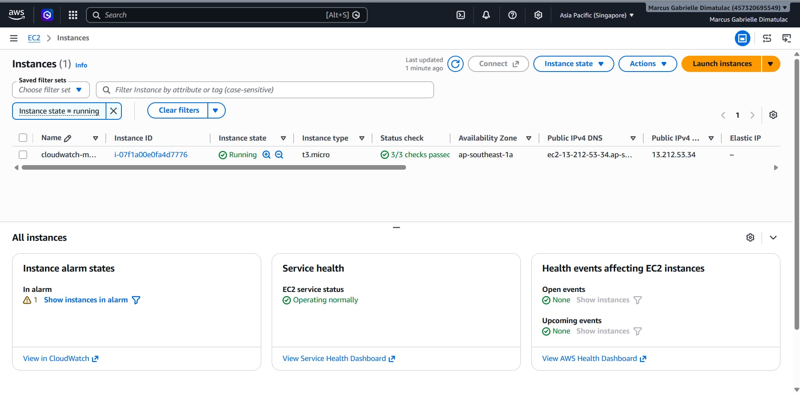
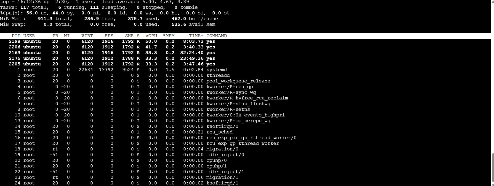
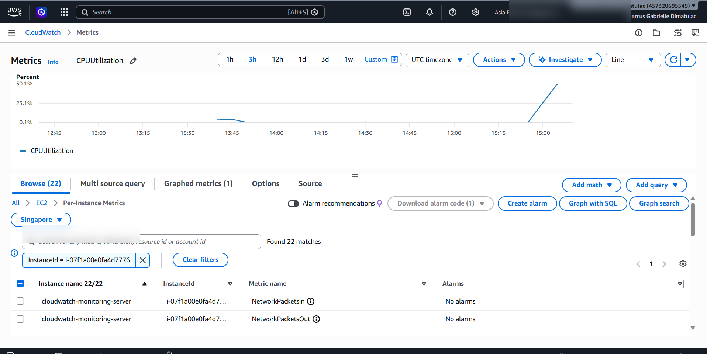
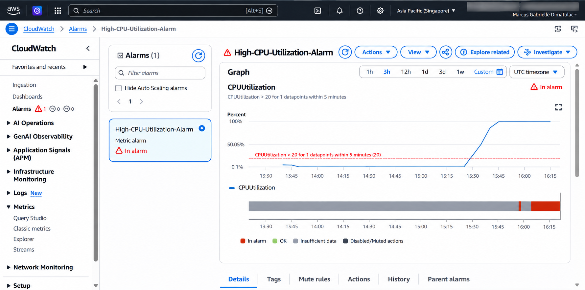
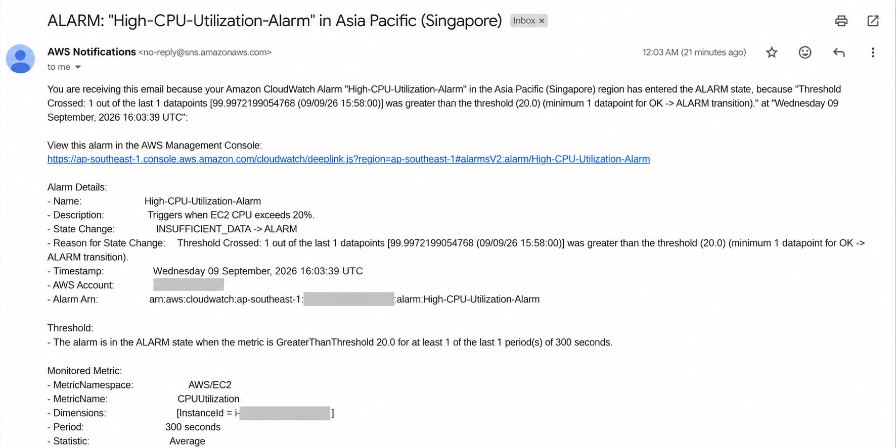

# AWS CloudWatch Monitoring Project

## Overview

This project demonstrates how to monitor an Amazon EC2 instance using AWS CloudWatch, configure alarms, and receive email notifications through Amazon SNS when CPU utilization exceeds a defined threshold.

## Services Used

- Amazon EC2
- Amazon CloudWatch
- Amazon SNS
- Ubuntu Linux

## Project Objectives

- Monitor EC2 CPU utilization
- Create CloudWatch alarms
- Configure SNS email notifications
- Simulate high CPU usage
- Verify alarm recovery after CPU usage returns to normal

## Architecture

```text
EC2 Instance
      |
      v
CloudWatch Metrics
      |
      v
CloudWatch Alarm
      |
      v
SNS Topic
      |
      v
Email Notification
```

## Project Workflow

1. Launch an EC2 instance.
2. Monitor CPUUtilization using CloudWatch.
3. Create a CloudWatch Alarm with a threshold of 20%.
4. Configure Amazon SNS email notifications.
5. Generate CPU load using Linux commands.
6. Trigger the CloudWatch alarm.
7. Receive email notification.
8. Stop the CPU load.
9. Verify alarm recovery.

---

## Screenshots

### EC2 Instance Running



### High CPU Process Simulation



### CloudWatch CPU Spike



### Alarm Configuration



### Email Alert




---

## Key Skills Demonstrated

- AWS CloudWatch Monitoring
- CloudWatch Alarms
- Amazon SNS
- EC2 Monitoring
- Linux Administration
- Troubleshooting
- Cloud Operations

## Outcome

Successfully monitored an EC2 instance using CloudWatch, configured alarms and notifications, simulated high CPU utilization, and verified automatic alarm recovery.
